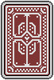

  
  <h1>
    Three Card Poker - v1.0.0
  </h1>

## About this project!
* Robust two-player game of three card poker with retro flair!
* Built in Java using the <a href="https://openjfx.io/" target="_blank">JavaFX</a> GUI library and FXML.
* Prototyped using <a href="https://www.figma.com/" target="blank">Figma</a>.
* Includes user customization of card backings!

## Instructions!
*NOTE: Ensure you have <a href="https://maven.apache.org/" target="blank">Apache Maven</a> installed on your machine locally.*

1. Clone this repository onto your device and go to the root directory of the project.
2. Run the command `mvn compile exec:java` into the command line.
3. Have fun!

## Preview!
#### 🖥️ Main Menu

#### 📔 Rules

#### 🕹️ Gameplay
##### Start

 
 

##### Bets Placed

 
 

##### Post-Game

